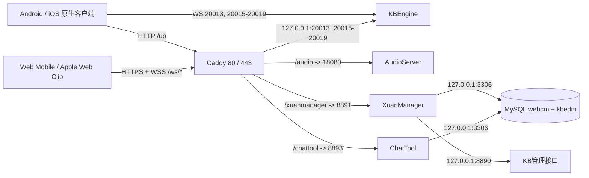

# 8L / Qing 项目服务器完整安装与迁移手册

最后核对：2026-08-14
适用仓库：`/Volumes/CCCC/qing`
当前公网IP：`154.37.155.17`
当前HTTPS域名：`154-37-155-17.sslip.io`

> 本文用于把当前游戏服务器迁移到新服务器，覆盖 KBEngine、MySQL、热更新、Web Mobile、推广下载站、AudioServer、XuanManager、ChatTool、Caddy、TLS、缓存、WSS、SSH、防火墙、定时任务、备份、验收和回滚。
>
> 文档不保存任何真实密码、数据库口令、签名、Token、语音ID密钥或玩家资料。所有标记为 `<从旧服安全迁移>` 的值必须通过加密通道复制，禁止写进Git、聊天记录或Web目录。

## 1. 迁移结论和硬性门槛

### 1.1 不要只复制 `/www/html`

完整迁移至少包含以下内容：

1. `/home/release/kbe` 的 KBEngine 二进制、资源、配置、启动方式和运行用户。
2. MySQL 5.7 的 `webcm`、`kbedm`、业务账号及原授权。
3. `/www/html/up`、Web Mobile、WebHome、三个业务服务及其私有运行配置。
4. Caddy基础Caddyfile、动态缓存/MIME路由、证书获取能力和日志目录。
5. 热更新ZIP自动解压的systemd path/service和两个root脚本。
6. `client_update` 的五组用户级cron任务。
7. SSH 2233、`updates`组、目录setgid权限、iptables/ip6tables和Fail2ban。
8. ChatTool媒体、AudioServer语音文件及二者数据库记录的一致恢复点。

### 1.2 当前无法由普通部署账号读取的root内容

2026-08-14使用`client_update`只读审计时，以下内容因权限限制无法查看：

- `/home/release/kbe`内部配置和KBEngine具体启动脚本；
- root的crontab、KBEngine可能使用的systemd unit；
- MySQL用户授权、root配置和完整数据库内容；
- `/etc/caddy/Caddyfile`源文件正文（已通过Caddy Admin API导出当前生效路由）；
- SSH服务的完整root配置。

因此，正式迁移前必须由旧服务器root执行第5章的导出命令。未取得root导出包前，不得关闭或销毁旧服务器，也不得宣称迁移已完整。

### 1.3 更换公网IP的最高风险

当前原生客户端和热更新清单直接使用裸IP，网页版和苹果描述文件使用由IP编码生成的sslip域名。若新服务器不能继承旧公网IP：

- 已安装的Android/iOS原生客户端仍会连接旧IP的WS和`/up`；
- 旧客户端无法从已经消失的旧IP取得“改地址”的热更新；
- 已安装的苹果Web Clip仍会打开旧sslip域名；
- 网页版WSS、语音和客服也仍指向旧sslip域名。

最安全切换方案是让新服务器继承`154.37.155.17`。若必须换IP，旧IP必须保留HTTP/WS转发到新服，直到强制更新后的客户端覆盖率达到要求；否则需要重新发原生安装包，并让苹果用户重新安装描述文件。

## 2. 当前已核实现网基准

| 项目 | 当前值 |
|---|---|
| 系统 | CentOS Linux 7 x86_64，内核`3.10.0-1127.el7.x86_64` |
| 资源 | 约7.5GiB内存、无Swap、30GiB系统盘；审计时使用约48% |
| 部署用户 | `client_update`，UID/GID 1000，主组`updates` |
| SSH | TCP 2233，密钥登录 |
| Caddy | v2.11.4，`/usr/local/bin/caddy`，systemd运行用户`caddy` |
| Caddy Admin API | `127.0.0.1:2019`，不得公网开放 |
| MySQL | 5.7.44，`127.0.0.1:3306` |
| 静态根目录 | `/www/html`，所有者`root:updates`，目录setgid |
| KB登录服 | 原生WS端口20013；网页WSS路径`/ws/20013/` |
| KB BaseApp | 当前20015、20016；20017～20019预留 |
| KB管理接口 | `http://127.0.0.1:8890`；进程当前监听所有地址，但被iptables阻断公网访问 |
| AudioServer | `/www/html/.audio-server`，端口18080，公网`/audio/` |
| XuanManager | `/www/html/.xuanmanager`，`127.0.0.1:8891`，公网`/xuanmanager/` |
| ChatTool | `/www/html/.chattool`，`127.0.0.1:8893`，公网`/chattool/` |
| Web Mobile | `/www/html/web-mobile`，约66MiB |
| 推广下载站 | `/www/html/webhome`，含APK约76MiB |
| 当前热更新 | `3.0.6`，3722项资源，公网`/up/`约73MiB |
| 历史热更新归档 | `/www/html/_processed`，审计时约1.8GiB |
| 语音数据 | `/www/html/.audio-server/data`，审计时约872KiB |
| 客服媒体 | `/www/html/.chattool/uploads`，审计时约888KiB |

### 2.1 当前公网入口

| 用途 | 地址 | 期望 |
|---|---|---|
| 原生热更新 | `http://154.37.155.17/up/` | HTTP 200 |
| 网页游戏 | `https://154-37-155-17.sslip.io/web-mobile/` | HTTP 200，入口no-store |
| 推广下载 | `https://154-37-155-17.sslip.io/webhome/` | HTTP 200，入口no-store |
| 原生语音 | `http://154.37.155.17/audio` | 健康检查200 |
| 网页语音 | `https://154-37-155-17.sslip.io/audio` | HTTPS/WSS |
| 后台 | `http://154.37.155.17/xuanmanager/`及HTTPS同路径 | 健康检查200 |
| 客服 | `http://154.37.155.17/chattool/`及HTTPS同路径 | 健康检查200 |
| 登录WSS | `wss://154-37-155-17.sslip.io/ws/20013/` | 101 |
| BaseApp WSS | `/ws/20015/`、`/ws/20016/` | 101 |
| 预留WSS | `/ws/20017/`～`/ws/20019/` | 对应KB进程未启动时502 |

## 3. 拓扑和端口



### 3.1 防火墙允许列表

公网只允许：

- TCP 2233：SSH/SFTP；
- TCP 80、443：Caddy；
- TCP和UDP 20000～20099：KBEngine原生客户端端口范围；
- ICMP、loopback、RELATED/ESTABLISHED。

必须阻止公网直接访问：2019、3306、8890、8891、8893、18080。完整模板见：

- `deploy/server/iptables.example`
- `deploy/server/ip6tables.example`
- `deploy/server/codex-iptables-restore.service.example`

若未来确认KB只需要更小端口范围，可单独收紧；在取得KB root配置前不要凭猜测删除20000～20099。

### 3.2 开发和构建机工具链

这些工具主要安装在构建机，不要求全部安装到正式服务器：

| 用途 | 要求 |
|---|---|
| Cocos客户端 | Cocos Creator 2.4.13；启动场景`assets/Scenes/login.fire` |
| XuanManager服务端 | Go 1.23或兼容版本（以`go.mod`为准） |
| ChatTool服务端 | Go 1.23或兼容版本（以`go.mod`为准） |
| AudioServer | Go 1.25或兼容版本（以`go.mod`为准） |
| 两套React/Vite前端 | Node.js 20或更高，使用仓库lock文件执行`npm ci` |
| 发布脚本 | Python 3、Node.js、OpenSSH/SFTP、rsync、zip/unzip |
| 苹果描述文件 | macOS `plutil`用于最终格式校验 |
| Android/iOS原生工程 | 当前封装在根目录`runtime-src.zip`，不要未经确认直接解压覆盖活动构建目录 |

Creator构建边界：Web Mobile启用MD5 Cache；Native热更新构建必须遵循`tools/generate_hot_update.py`的检查，不能把Web的MD5规则套到Native。正式生成热更新前必须确认Creator脚本编译产物比最新TypeScript源码新。

## 4. 新旧服务器变量表

迁移前先填写，不要把密码填入本文：

| 变量 | 当前值 | 新服务器填写 |
|---|---|---|
| `QING_OLD_IP` | `154.37.155.17` |  |
| `QING_NEW_IP` | 同旧IP最安全 |  |
| `QING_PUBLIC_HOST` | `154-37-155-17.sslip.io` | 若IP变化则同步变化 |
| `QING_SSH_PORT` | `2233` |  |
| `QING_DEPLOY_USER` | `client_update` |  |
| `QING_DEPLOY_GROUP` | `updates` |  |
| `QING_WEB_ROOT` | `/www/html` |  |
| `QING_KBE_ROOT` | `/home/release/kbe` | root导出后确认 |
| `QING_DB_VERSION` | MySQL 5.7.44 | 建议先保持兼容 |

## 5. 旧服务器停机前root导出

### 5.1 建立受保护的迁移目录

```bash
export QING_MIGRATION_DIR=/root/qing-migration-$(date +%Y%m%d-%H%M%S)
install -d -m 0700 "$QING_MIGRATION_DIR"
```

### 5.2 导出数据库和授权

在短暂停写或维护窗口内执行，保证`webcm`、`kbedm`与媒体文件是同一恢复点：

```bash
mysqldump -u root -p \
  --single-transaction --quick --routines --triggers --events --hex-blob \
  --default-character-set=utf8mb4 \
  --databases webcm kbedm \
  > "$QING_MIGRATION_DIR/mysql-webcm-kbedm.sql"

mysql -u root -p -NBe \
  "SELECT user,host,plugin FROM mysql.user ORDER BY user,host" \
  > "$QING_MIGRATION_DIR/mysql-users-nonsecret.txt"
```

另外逐个执行并保存XuanManager、ChatTool、KBEngine所用MySQL账号的`SHOW GRANTS FOR ...`结果。不要复制`mysql.user`系统表，不要把明文口令写进命令历史；优先在新服重新创建账号并恢复相同授权。

### 5.3 导出KBEngine和root启动配置

```bash
tar --xattrs --acls --numeric-owner -C /home/release \
  -czf "$QING_MIGRATION_DIR/kbe-release.tgz" kbe

systemctl list-unit-files > "$QING_MIGRATION_DIR/systemd-unit-files.txt"
systemctl list-units --all > "$QING_MIGRATION_DIR/systemd-units-current.txt"
crontab -u root -l > "$QING_MIGRATION_DIR/root.crontab" 2>/dev/null || true

grep -R -n -E 'kbe|baseapp|loginapp|cellapp|interfaces|dbmgr' \
  /etc/systemd/system /usr/lib/systemd/system /etc/rc.d /etc/cron.d \
  > "$QING_MIGRATION_DIR/kbe-startup-references.txt" 2>/dev/null || true
```

还必须记录KB运行用户、环境变量、工作目录、配置文件、启动/停止顺序和端口映射。当前只确认存在`baseappmgr`、`loginapp`和两个`baseapp`进程，不能据此推断完整启动命令。

### 5.4 导出Web、业务服务和私密配置

```bash
tar --xattrs --acls --numeric-owner -C /www/html -czf \
  "$QING_MIGRATION_DIR/qing-web-services.tgz" \
  .audio-server .xuanmanager .chattool \
  web-mobile webhome up \
  .web-mobile-caddy-cache .webhome-caddy-headers

# 历史包可选；不影响当前运行，但便于回溯。
tar --xattrs --acls --numeric-owner -C /www/html -czf \
  "$QING_MIGRATION_DIR/hot-update-history.tgz" _processed
```

必须保留但禁止入Git的文件：

- `.audio-server/id-secret`；
- `.xuanmanager/runtime.env`；
- `.chattool/deploy/centos7-user/runtime.env`；
- KBEngine私密配置；
- MySQL dump和授权记录。

### 5.5 导出基础设施配置

```bash
cp -a /etc/caddy "$QING_MIGRATION_DIR/"
cp -a /etc/systemd/system/caddy.service "$QING_MIGRATION_DIR/"
cp -a /etc/systemd/system/codex-iptables-restore.service "$QING_MIGRATION_DIR/"
cp -a /etc/sysconfig/iptables /etc/sysconfig/ip6tables "$QING_MIGRATION_DIR/"
cp -a /usr/local/sbin/stonewar-auto-unzip-updates.sh "$QING_MIGRATION_DIR/"
cp -a /usr/local/sbin/stonewar-update-burst-watch.sh "$QING_MIGRATION_DIR/"
cp -a /etc/systemd/system/stonewar-update-unzip* "$QING_MIGRATION_DIR/"
crontab -u client_update -l > "$QING_MIGRATION_DIR/client_update.crontab"

sshd -T > "$QING_MIGRATION_DIR/sshd-effective.txt"
fail2ban-client status > "$QING_MIGRATION_DIR/fail2ban-status.txt" 2>/dev/null || true
```

### 5.6 生成校验并加密离机

```bash
find "$QING_MIGRATION_DIR" -type f -print0 | sort -z | \
  xargs -0 sha256sum > "$QING_MIGRATION_DIR/SHA256SUMS"
```

迁移包应使用离线加密介质或受控加密通道传输。校验成功前不要删除旧服数据。

## 6. 新服务器基础安装

### 6.1 操作系统选择

当前是已停止常规维护的CentOS 7。两种方式：

- 最小风险搬迁：云厂商整机镜像/磁盘克隆，保持现有ABI，再单独安排系统升级；
- 新装系统：Rocky/AlmaLinux 8或9等受支持系统，但必须先在隔离环境验证旧KBEngine二进制、glibc、Python和MySQL兼容性。

未经KB测试，不要直接把正式游戏服从CentOS 7跨到新ABI。

### 6.2 创建用户和目录

```bash
groupadd -g 1000 updates
useradd -u 1000 -g updates -m -s /bin/bash client_update

install -d -m 2775 -o root -g updates /www/html
install -d -m 2775 -o root -g updates \
  /www/html/up /www/html/_incoming /www/html/_processed \
  /www/html/_failed /www/html/.extracting
```

若新服务器UID/GID无法使用1000，使用`rsync --numeric-ids`前先制定映射，避免私密文件归属错误。

### 6.3 必需软件

运行节点至少需要：

- OpenSSH Server、rsync 3.x、curl、unzip、tar、gzip、openssl；
- iptables/ip6tables、Fail2ban；
- MySQL 5.7兼容环境；
- Caddy v2（当前验证版本2.11.4）；
- `flock`、`find`、`sha256sum`、`stat`等基础工具。

Go、Node.js和npm只在构建机需要；正式服务器部署的是静态Go二进制和构建后的Web目录。AudioServer当前自带静态FFmpeg，不依赖系统FFmpeg。

### 6.4 SSH与Fail2ban

1. SSH改到2233；先保留当前连接，验证新端口密钥登录后再关闭22。
2. `client_update`仅放部署公钥；`.ssh`为0700，`authorized_keys`为0600。
3. 禁用root远程登录和密码登录前，先确认有可用的带sudo运维账号。
4. 启用Fail2ban sshd jail，并确认它与静态`f2b-sshd`链兼容。

### 6.5 防火墙

把`deploy/server/iptables.example`和`ip6tables.example`审阅后安装到系统规则位置，再安装`codex-iptables-restore.service.example`。应用前必须保持一个已登录SSH会话，并先用`iptables-restore --test`验证，避免把自己锁在服务器外。

## 7. MySQL恢复

1. MySQL只绑定`127.0.0.1:3306`，禁止3306公网放行。
2. 字符集保持`utf8mb4`，排序规则与现有服务DSN兼容。
3. 导入旧服dump：

```bash
mysql -u root -p < mysql-webcm-kbedm.sql
```

4. 重新创建XuanManager、ChatTool、KBEngine数据库账号，恢复旧服`SHOW GRANTS`的等价授权。
5. XuanManager和ChatTool启动会执行尚未记录的内嵌迁移；不得删除或手工伪造`mgr_schema_migration`、`chat_schema_migration`。
6. 恢复后先只读核对两库表数、关键迁移版本和业务行数，再启动写入服务。

## 8. KBEngine恢复

1. 使用root恢复`/home/release/kbe`并保持原所有者、权限、符号链接和可执行位。
2. 恢复旧服root systemd/cron/启动脚本；不要只手工启动四个当前可见进程。
3. 确认MySQL连接、Python脚本、资源路径和服务器时区。
4. 启动顺序以旧服root导出为准。
5. 至少确认：

```text
0.0.0.0:20013  登录服WebSocket
0.0.0.0:20015  BaseApp
0.0.0.0:20016  BaseApp
127.0.0.1或防火墙保护的8890  管理接口
```

20017～20019只配置Caddy预留路由；没有对应BaseApp监听时502是正常状态。

## 9. Caddy完整安装

### 9.1 文件

- 完整模板：`deploy/server/Caddyfile.example`
- 环境变量：`deploy/server/qing.env.example`
- systemd：`deploy/server/caddy.service.example`

安装位置：

```text
/usr/local/bin/caddy
/etc/caddy/Caddyfile
/etc/caddy/qing.env
/etc/systemd/system/caddy.service
/var/lib/caddy                 # caddy:caddy
/var/log/caddy                 # caddy:caddy
```

`qing.env`只保存公网IP和域名，不保存业务密码：

```bash
QING_PUBLIC_IP=<新公网IP>
QING_PUBLIC_HOST=<新IP转换为短横线>.sslip.io
```

若使用正式自有域名，直接把`QING_PUBLIC_HOST`改为正式域名并完成DNS A记录。

### 9.2 验证和启动

```bash
caddy fmt --overwrite /etc/caddy/Caddyfile
caddy validate --config /etc/caddy/Caddyfile --adapter caddyfile
systemctl daemon-reload
systemctl enable --now caddy
curl --fail http://127.0.0.1:2019/config/apps/http/servers/
```

Admin API必须只监听127.0.0.1。公网安全组和iptables都不得开放2019。

### 9.3 必须保留的Caddy行为

- HTTP裸IP提供原生热更新、旧后台、原生语音和静态文件。
- sslip/正式域名提供HTTPS、WSS、网页游戏、网页语音和网页客服。
- `/chattool`重定向到`/chattool/`；建议`/xuanmanager`也重定向到带斜杠地址。
- ChatTool SSE必须`flush_interval -1`，请求体上限110MB。
- WSS路径剥离`/ws/<port>`后代理到本机对应KB端口，读写超时10分钟。
- 静态文件服务器必须隐藏所有点目录、服务私密目录、上传暂存和历史包目录。
- Caddy访问日志写`/var/log/caddy/update-access.log`，50MiB滚动、保留10份/30天。

### 9.4 正确缓存策略

| 路径 | 缓存策略 |
|---|---|
| `/web-mobile/`、`index.html` | `no-store, max-age=0` |
| Web Mobile带MD5的成功2xx资源 | `public, max-age=31536000, immutable` |
| Web Mobile不存在的404资源 | 不附加immutable |
| WebHome HTML/JS/CSS/JSON | `no-store, max-age=0` |
| `.mobileconfig` | no-store、苹果MIME、attachment，仅2xx添加 |
| `/up/project.manifest`、`version.manifest` | `no-store, max-age=0` |
| `/up/src/*`、`/up/assets/*` | `no-cache`，路径未内容哈希，禁止immutable |

现网基础配置曾对整个`/up/*`设置immutable。新模板已经纠正；迁移时不要复制这条旧策略。

## 10. 动态Caddy缓存/MIME路由

完整Caddyfile负责核心静态和代理路径；以下动态路由补充“仅成功2xx才加缓存/MIME”的精确条件：

```text
仓库 tools/web_mobile_caddy_cache/
  -> /www/html/.web-mobile-caddy-cache/

仓库 tools/webhome_caddy_headers/
  -> /www/html/.webhome-caddy-headers/
```

安装：

```bash
chmod 755 /www/html/.web-mobile-caddy-cache/install-caddy-routes.sh
chmod 755 /www/html/.webhome-caddy-headers/install-caddy-route.sh
/www/html/.web-mobile-caddy-cache/install-caddy-routes.sh
/www/html/.webhome-caddy-headers/install-caddy-route.sh
```

模板经Caddy 2.11.4适配后，HTTPS服务器仍为`srv0`，与现有安装脚本一致。每分钟看门狗只在ID缺失时插入，不会每分钟重载Caddy。

## 11. 热更新自动解压服务

仓库已经保存现网root脚本和unit：`deploy/server/hot-update/`。

安装：

```bash
install -m 0755 deploy/server/hot-update/stonewar-auto-unzip-updates.sh \
  /usr/local/sbin/stonewar-auto-unzip-updates.sh
install -m 0755 deploy/server/hot-update/stonewar-update-burst-watch.sh \
  /usr/local/sbin/stonewar-update-burst-watch.sh
install -m 0644 deploy/server/hot-update/stonewar-update-unzip.path \
  /etc/systemd/system/stonewar-update-unzip.path
install -m 0644 deploy/server/hot-update/stonewar-update-unzip.service \
  /etc/systemd/system/stonewar-update-unzip.service
install -m 0644 deploy/server/hot-update/stonewar-update-unzip-burst.service \
  /etc/systemd/system/stonewar-update-unzip-burst.service
install -m 0644 deploy/server/hot-update/stonewar-update-unzip.timer \
  /etc/systemd/system/stonewar-update-unzip.timer

systemctl daemon-reload
systemctl enable --now stonewar-update-unzip.path
```

正常主机制是path单元触发burst扫描。timer是可选兜底，当前现网禁用；若启用timer，仍有锁目录防止重复处理。

处理流程：SFTP先上传`.uploading`临时文件，原子改名为ZIP；root脚本验证ZIP、拒绝路径穿越和符号链接，在`.extracting`解压后原子替换`/www/html/up`，成功ZIP移入`_processed`，失败移入`_failed`。

## 12. AudioServer安装

### 12.1 构建和部署文件

```bash
cd AudioServer
go test ./...
CGO_ENABLED=0 GOOS=linux GOARCH=amd64 go build \
  -trimpath -ldflags='-s -w' -o bin/audioserver ./cmd/audioserver
```

部署到`/www/html/.audio-server`：

- `bin/audioserver`；
- 可执行的静态`bin/ffmpeg`；
- `deploy/centos7-user/config.json`；
- `deploy/centos7-user/*.sh`和Caddy route JSON；
- 仅服务器保存的`id-secret`，至少32字符；
- 需要保留历史语音时恢复`data/`。

新服务器建议把`config.json`的`http_address`从现网的`:18080`改为`127.0.0.1:18080`，减少对防火墙的依赖。公网TLS由Caddy终止，AudioServer本身不加载证书。

当前`config.json`运行参数必须保持兼容：16kHz、单声道、24k AAC、最短300ms、最长10秒、单帧最大32768字节；语音保留168小时，10分钟清理一次，未完成文件15分钟过期，最大1000连接/100个并发录音。可使用以下环境变量覆盖JSON：

```text
AUDIO_SERVER_ID_SECRET       # 必填，通过id-secret注入
AUDIO_SERVER_HTTP_ADDR
AUDIO_SERVER_HTTPS_ADDR
AUDIO_SERVER_TLS_CERT_FILE
AUDIO_SERVER_TLS_KEY_FILE
AUDIO_SERVER_DATA_DIR
AUDIO_SERVER_FFMPEG_PATH
```

新服继续使用Caddy终止TLS时，`HTTPS_ADDR`和两个证书文件变量保持空；不要让AudioServer和Caddy同时抢占443。

```bash
chmod 0700 /www/html/.audio-server
chmod 0600 /www/html/.audio-server/id-secret /www/html/.audio-server/config.json
chmod 0755 /www/html/.audio-server/*.sh /www/html/.audio-server/bin/*
/www/html/.audio-server/install-cron.sh
/www/html/.audio-server/start.sh
```

## 13. XuanManager安装

### 13.1 构建

```bash
cd XuanManager/web
npm ci
npm run lint
npm run build

cd ../server
go test ./...
go vet ./...
CGO_ENABLED=0 GOOS=linux GOARCH=amd64 go build \
  -trimpath -ldflags='-s -w' -o bin/xuanmanager ./cmd/xuanmanager
```

### 13.2 目录和配置

```text
/www/html/.xuanmanager/bin/xuanmanager
/www/html/.xuanmanager/web/
/www/html/.xuanmanager/runtime.env
/www/html/.xuanmanager/{start,stop,run,supervise,install-cron,install-caddy-route}.sh
```

`runtime.env`必须包含：

```text
XUAN_HTTP_ADDR=127.0.0.1:8891
XUAN_STATIC_DIR=/www/html/.xuanmanager/web
XUAN_DB_HOST=127.0.0.1
XUAN_DB_PORT=3306
XUAN_DB_NAME=webcm
XUAN_DB_USER=<从旧服安全迁移>
XUAN_DB_PASSWORD=<从旧服安全迁移>
XUAN_GAME_DB_HOST=127.0.0.1
XUAN_GAME_DB_PORT=3306
XUAN_GAME_DB_NAME=kbedm
XUAN_GAME_DB_USER=<从旧服安全迁移>
XUAN_GAME_DB_PASSWORD=<从旧服安全迁移>
XUAN_GAME_ADMIN_URL=http://127.0.0.1:8890
XUAN_NOTIFICATION_CAROUSEL_WORKER=true
XUAN_GAME_EXCHANGE_SIGN=<从旧服安全迁移>
XUAN_COOKIE_SECURE=false
XUAN_SESSION_TTL=8h
```

已有数据库恢复时不要再次设置bootstrap密码。全新库仅首次设置`XUAN_BOOTSTRAP_ADMIN_*`，创建成功后立即删除密码。

完整可选初始化变量为：

```text
XUAN_BOOTSTRAP_ADMIN_USERNAME=<仅全新库首次使用>
XUAN_BOOTSTRAP_ADMIN_PASSWORD=<仅全新库首次使用，成功后删除>
XUAN_BOOTSTRAP_ADMIN_NAME=超级管理员
```

约束：会话时长只能为30分钟到168小时；两个数据库主机只允许`127.0.0.1`或`localhost`；库名固定`webcm`和`kbedm`；游戏管理地址固定本机HTTP 8890且不能带额外路径。

```bash
chmod 0700 /www/html/.xuanmanager
chmod 0600 /www/html/.xuanmanager/runtime.env
chmod 0755 /www/html/.xuanmanager/*.sh /www/html/.xuanmanager/bin/xuanmanager
/www/html/.xuanmanager/install-cron.sh
/www/html/.xuanmanager/start.sh
```

轮播worker只允许正式8891进程为true，候选进程必须false。

## 14. ChatTool安装

### 14.1 构建

```bash
cd ChatTool/web
npm ci
npm run lint
npm run build

cd ../server
go test ./...
go vet ./...
CGO_ENABLED=0 GOOS=linux GOARCH=amd64 go build \
  -trimpath -ldflags='-s -w' -o bin/chattool ./cmd/chattool
```

### 14.2 目录和配置

```text
/www/html/.chattool/bin/chattool
/www/html/.chattool/web/
/www/html/.chattool/uploads/
/www/html/.chattool/deploy/centos7-user/runtime.env
/www/html/.chattool/deploy/centos7-user/*.sh及Caddy JSON
```

关键运行变量：

```text
CHAT_HTTP_ADDR=127.0.0.1:8893
CHAT_PUBLIC_BASE_URL=http://<公网IP>/chattool
CHAT_STATIC_DIR=/www/html/.chattool/web
CHAT_UPLOAD_DIR=/www/html/.chattool/uploads
CHAT_COOKIE_SECURE=false
CHAT_DB_HOST=127.0.0.1
CHAT_DB_PORT=3306
CHAT_DB_NAME=webcm
CHAT_DB_USER=<从旧服安全迁移>
CHAT_DB_PASSWORD=<从旧服安全迁移>
CHAT_PLAYER_LINK_KEY=<从旧服安全迁移，必须与客户端Tool.encrypt一致>
CHAT_PLAYER_LINK_TTL=15m
CHAT_MESSAGE_RETENTION=48h
```

`CHAT_PLAYER_LINK_KEY`不能随意重新生成，否则已发布客户端生成的玩家入口密文无法解析。已有数据库恢复时不要再次设置bootstrap密码。

其余可选变量及默认值：

```text
CHAT_AGENT_SESSION_TTL=12h
CHAT_PLAYER_SESSION_TTL=24h
CHAT_AGENT_OFFLINE_AFTER=90s
CHAT_CONVERSATION_IDLE=24h
CHAT_MAX_IMAGE_BYTES=10485760
CHAT_MAX_VIDEO_BYTES=104857600
CHAT_MAX_FILE_BYTES=26214400
CHAT_BOOTSTRAP_USERNAME=<仅全新库首次使用>
CHAT_BOOTSTRAP_PASSWORD=<仅全新库首次使用，成功后删除>
CHAT_BOOTSTRAP_NAME=客服主管
```

时长约束：客服会话30分钟～7天、玩家会话30分钟～30天、玩家入口1分钟～24小时、离线判断30秒～10分钟、会话空闲1小时～30天、消息保留1小时～365天。`CHAT_PLAYER_LINK_KEY`长度必须为16～128字符。

```bash
chmod 0700 /www/html/.chattool
chmod 0700 /www/html/.chattool/uploads
chmod 0600 /www/html/.chattool/deploy/centos7-user/runtime.env
chmod 0755 /www/html/.chattool/deploy/centos7-user/*.sh /www/html/.chattool/bin/chattool
/www/html/.chattool/deploy/centos7-user/install-cron.sh
/www/html/.chattool/deploy/centos7-user/start.sh
```

ChatTool数据库和`uploads/`必须用同一恢复点；只恢复其中一项会产生丢失附件或悬空记录。

## 15. Web Mobile、推广站和热更新发布

### 15.1 本地连接配置

`.hot-update-upload-config.json`：

```json
{
  "host": "<服务器IP>",
  "port": 2233,
  "user": "client_update",
  "identity_file": "~/.ssh/id_ed25519_newserver",
  "remote_dir": "/www/html/_incoming"
}
```

私钥只存在本机，不上传服务器、不提交Git。

### 15.2 四个发布入口

1. `1生成热更新包.command`：从最新Native构建生成清单和ZIP。
2. `2上传最新热更新.command`：SFTP原子上传到`_incoming`，等待root path服务解压并校验远端版本/MD5。
3. `3上传网页版.command`：原子切换`/www/html/web-mobile`，保留`.web-mobile.previous`。
4. `4上传推广网站.command`：原子切换`/www/html/webhome`，保留`.webhome.previous`；相同APK不重复上传。

热更新`.hot-update-config.json`的`server_url`必须与仍在使用的原生客户端地址一致。IP变化时必须先解决旧客户端如何访问旧`/up`的问题。

`3上传网页版.command`会在打包前调用`tools/protect_web_images.js`处理网页版图片资源并校验产物；不要绕过脚本直接复制`build/web-mobile`，否则会丢失图片保护、ZIP完整性、权限、哈希回读和原子回滚保护。

`.hot-update-config.json`当前还包含`encrypt_images=true`。热更新生成脚本会按项目旧格式加密PNG并同步Native待打包资源；更换服务器不需要改变算法或密钥，只需迁移生成后的`/up`内容。

### 15.3 WebHome苹果描述文件

`WebHome/site-config.json`同时决定推广站地址和苹果Web Clip游戏地址。每次变更域名后执行：

```bash
python3 WebHome/scripts/generate_mobileconfig.py
plutil -lint WebHome/downloads/8L.mobileconfig
```

再用上传脚本发布。已安装的旧描述文件不会自动改URL；域名变化时用户必须删除旧图标/描述文件并重新安装。

`WebHome/site-config.json`完整字段包括站点名、游戏名、版本文案、推广站URL、APK相对路径、mobileconfig相对路径、Web Clip游戏URL、Payload标识、组织名和描述。`androidApkUrl`与`iosProfileUrl`必须继续指向推广站内安全相对路径；`promotionSiteUrl`和`iosGameUrl`必须是完整HTTP/HTTPS地址。Payload标识更改会被iOS视为不同描述文件，非必要不要修改。

## 16. `client_update`完整cron

正式服务器当前需要以下任务：

```cron
@reboot /www/html/.audio-server/start.sh >/dev/null 2>&1 # qing-audio-server
* * * * * /www/html/.audio-server/install-caddy-route.sh >/dev/null 2>&1 # qing-audio-caddy-route
@reboot /www/html/.xuanmanager/start.sh >/dev/null 2>&1 # qing-xuanmanager-server
* * * * * /www/html/.xuanmanager/install-caddy-route.sh >/dev/null 2>&1 # qing-xuanmanager-caddy-route
@reboot /www/html/.chattool/deploy/centos7-user/start.sh >/dev/null 2>&1 # qing-chattool-server
* * * * * /www/html/.chattool/deploy/centos7-user/install-caddy-routes.sh >/dev/null 2>&1 # qing-chattool-caddy-routes
* * * * * /www/html/.web-mobile-caddy-cache/install-caddy-routes.sh >/dev/null 2>&1 # qing-web-mobile-caddy-cache
* * * * * /www/html/.webhome-caddy-headers/install-caddy-route.sh >/dev/null 2>&1 # qing-webhome-mobileconfig-headers
```

前三组业务服务的代理已经写进完整Caddyfile；它们的动态路由是现网兼容看门狗，不可用来代替基础Caddyfile。Web Mobile和WebHome两组动态路由仍负责精确2xx缓存/MIME规则，必须保留。

## 17. IP或域名变化时必须修改的位置

先运行全仓搜索，不能只改一处：

```bash
rg -n '154\.37\.155\.17|154-37-155-17\.sslip\.io' \
  . -g '!library/**' -g '!temp/**' -g '!build/**' -g '!hot-update-output/**'
```

重点文件：

| 文件/位置 | 影响 |
|---|---|
| `assets/scripts/common/GameDef.ts` | 原生IP、网页版HTTPS/WSS、语音、客服 |
| `assets/scripts/UI/panelKefu.ts` | 客服备用地址 |
| `.hot-update-config.json` | 新生成热更新清单的`packageUrl` |
| `.hot-update-upload-config.json` | SSH/SFTP新服务器 |
| `WebHome/site-config.json` | 推广站和苹果Web Clip URL |
| `WebHome/downloads/8L.mobileconfig` | 必须重新生成，不能手改二进制Plist |
| `deploy/server/qing.env` | Caddy公网IP/域名 |
| `tools/web_mobile_caddy_cache/*.json`、`tools/webhome_caddy_headers/*.json` | HTTPS域名缓存/MIME路由host |
| Audio/Xuan/Chat Caddy JSON | 动态兼容路由host |
| ChatTool `runtime.env` | `CHAT_PUBLIC_BASE_URL` |
| Web Mobile正式构建 | 必须重新构建和上传，不能只改源码 |

移动端保持WS、网页版走WSS的现有平台边界不能被地址替换操作破坏。

## 18. 安装后逐层验收

### 18.1 本机监听和服务

```bash
ss -lnt
curl --fail http://127.0.0.1:18080/healthz
curl --fail http://127.0.0.1:8891/api/health
curl --fail http://127.0.0.1:8893/api/health
```

确认3306、8891、8893只监听loopback；AudioServer新安装也应改为loopback。2019只监听127.0.0.1。

### 18.2 Caddy路由ID

```bash
for route_id in \
  qing_web_mobile_index_no_store \
  qing_web_mobile_assets_immutable \
  qing_webhome_entry_cache_headers \
  qing_webhome_mobileconfig_headers; do
  curl --fail "http://127.0.0.1:2019/id/$route_id" >/dev/null
done
```

### 18.3 公网HTTP/HTTPS

```bash
curl -fI "http://<公网IP>/up/version.manifest"
curl -fI "https://<公网域名>/web-mobile/"
curl -fI "https://<公网域名>/webhome/"
curl -f "https://<公网域名>/audio/healthz"
curl -f "https://<公网域名>/chattool/api/health"
curl -f "https://<公网域名>/xuanmanager/api/health"
```

### 18.4 WSS握手

```bash
curl --http1.1 -i --max-time 8 \
  -H 'Connection: Upgrade' \
  -H 'Upgrade: websocket' \
  -H 'Sec-WebSocket-Version: 13' \
  -H 'Sec-WebSocket-Key: dGhlIHNhbXBsZSBub25jZQ==' \
  "https://<公网域名>/ws/20013/"
```

对20015、20016重复，必须看到`101 Switching Protocols`。20017～20019只有对应KB进程启用后才要求101。

### 18.5 缓存和安全负向检查

```bash
curl -sSI "https://<公网域名>/web-mobile/"
curl -sSI "https://<公网域名>/webhome/"
curl -sSI "https://<公网域名>/webhome/downloads/8L.mobileconfig"
curl -sSI "https://<公网域名>/up/version.manifest"

# 下列路径必须是403或404，绝不能200：
curl -sSI "https://<公网域名>/.xuanmanager/runtime.env"
curl -sSI "https://<公网域名>/.chattool/deploy/centos7-user/runtime.env"
curl -sSI "https://<公网域名>/.web-mobile-caddy-cache/caddy-index-route.json"
curl -sSI "https://<公网域名>/_processed/"
```

### 18.6 热更新闭环

1. 在测试版本执行`1生成热更新包.command`。
2. 执行`2上传最新热更新.command`。
3. 确认ZIP进入`_processed`而不是`_failed`。
4. 确认公网两个manifest版本、资源数与本地一致。
5. 抽检至少5个资源的长度和MD5。
6. 用旧版本真实Android/iOS客户端完成发现更新、下载、重启和进入大厅。

### 18.7 真实业务验收

- 原生Android/iOS登录、进大厅、进房、断线重连；
- 网页版登录、WSS切LoginApp/BaseApp、进房、场景加载；
- iPhone Web Clip麦克风、语音发送/播放、GPS、常亮；
- XuanManager超级管理员和受限角色登录、权限、审计、KB命令；
- ChatTool玩家/客服两端、SSE、图片/视频、队列和单点登录；
- 推广站Android/iOS设备识别、APK下载、mobileconfig安装。

静态200和健康接口通过不能替代真实账号/真机验收。

## 19. 重启演练

切流量前在维护窗口执行一次完整重启：

1. 重启Caddy，确认HTTPS证书和四个缓存/MIME route ID恢复。
2. 停止/启动AudioServer、XuanManager、ChatTool，确认supervisor PID和健康接口。
3. 重启服务器，等待约90秒，确认用户cron、Caddy、MySQL、KBEngine和热更新path全部恢复。
4. 再做第18章全部检查。

若KBEngine没有root级开机启动证明，不得通过重启验收。

## 20. 切换和回滚

### 20.1 切换顺序

1. 新服务器离线安装并恢复数据。
2. 停止旧服业务写入，做最后增量数据库和媒体同步。
3. 启动新服内部服务并完成本机验收。
4. 更新/继承公网IP或配置旧IP转发。
5. 完成公网、WSS、真机验收。
6. 观察Caddy日志、5xx、KB在线、数据库、磁盘和语音/客服队列。
7. 至少保留旧服完整只读回滚窗口，不要立即销毁。

### 20.2 回滚条件

出现以下任一情况应回切旧服：

- 旧客户端无法发现热更新或连接KB；
- WSS LoginApp/BaseApp切换失败；
- 数据库行数/迁移版本不一致；
- XuanManager或ChatTool出现持续5xx、权限/会话异常；
- 语音上传成功但文件/元数据不一致；
- Caddy重启后动态路由无法恢复；
- 防火墙误开放3306、8890、8891、8893、18080或2019。

回滚必须同时恢复应用、数据库和媒体到同一个时间点，不能只回滚二进制。

## 21. 日常备份与监控

建议至少：

- 每日备份`webcm`、`kbedm`；
- ChatTool数据库与`uploads/`同一恢复点；
- AudioServer `data/`和`id-secret`；
- Caddyfile、qing.env、动态route JSON、cron、iptables和systemd unit；
- 当前`/up`及必要的`_processed`历史包；
- 监控磁盘、MySQL、Caddy 5xx、WSS 502、Audio/Chat/Xuan健康接口和证书续期；
- 定期执行恢复演练，而不是只确认备份文件存在。

`_processed`会持续增长，当前已约1.8GiB；制定保留版本数后再清理，禁止无校验直接删除当前或最近回滚包。

## 22. 配置来源索引

| 配置 | 仓库位置 |
|---|---|
| 完整Caddy模板 | `deploy/server/Caddyfile.example` |
| Caddy systemd/env | `deploy/server/caddy.service.example`、`qing.env.example` |
| 防火墙 | `deploy/server/iptables.example`、`ip6tables.example` |
| 热更新解压root服务 | `deploy/server/hot-update/` |
| Web Mobile缓存路由 | `tools/web_mobile_caddy_cache/` |
| WebHome缓存/MIME路由 | `tools/webhome_caddy_headers/` |
| Audio部署 | `AudioServer/deploy/centos7-user/` |
| XuanManager部署 | `XuanManager/deploy/centos7-user/`、`XuanManager/部署说明.md` |
| ChatTool部署 | `ChatTool/deploy/centos7-user/`、`ChatTool/docs/deployment.md` |
| 热更新生成/上传 | `tools/generate_hot_update.py`、`tools/upload_latest_hot_update.py` |
| 网页上传 | `tools/upload_web_mobile.py` |
| 推广站上传 | `tools/upload_promotion_site.py` |
| 客户端公网地址 | `assets/scripts/common/GameDef.ts` |
| 苹果描述文件 | `WebHome/site-config.json`、`WebHome/scripts/generate_mobileconfig.py` |

## 23. 最终签字清单

- [ ] root导出包已取得并通过SHA-256校验。
- [ ] KBEngine完整目录、启动方式、端口和运行用户已核对。
- [ ] `webcm`、`kbedm`和MySQL授权已恢复。
- [ ] 私密配置只存在于受控服务器路径，权限0600/0700。
- [ ] Caddy基础配置、HTTPS证书、WSS、代理和隐藏目录检查通过。
- [ ] Web Mobile/WebHome缓存头和mobileconfig MIME检查通过。
- [ ] 热更新path服务、ZIP原子发布和真实旧客户端升级通过。
- [ ] Audio/Xuan/Chat用户cron和重启恢复通过。
- [ ] 防火墙仅开放2233、80、443、20000～20099及必要协议。
- [ ] Android、iOS、iPhone Web Clip和后台/客服真实流程通过。
- [ ] 旧IP继承或过渡转发方案已验证。
- [ ] 回滚包、回滚步骤和观察窗口已确认。

只有全部勾选后，才可以下线旧服务器。
